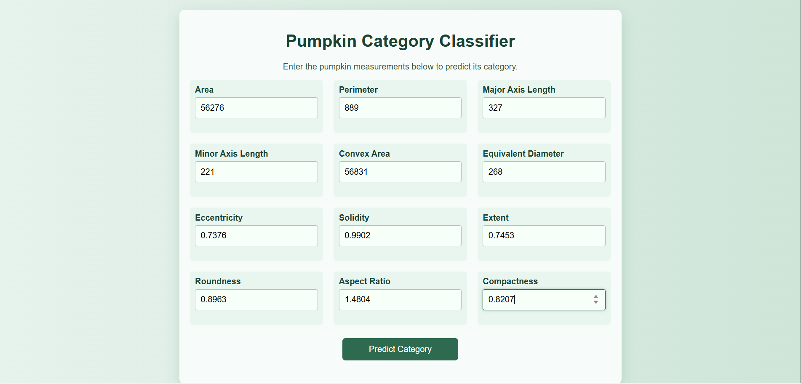
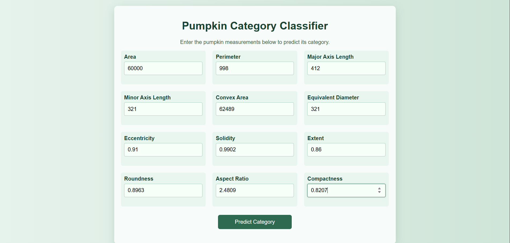
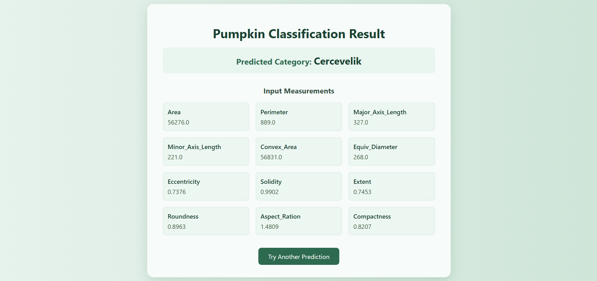
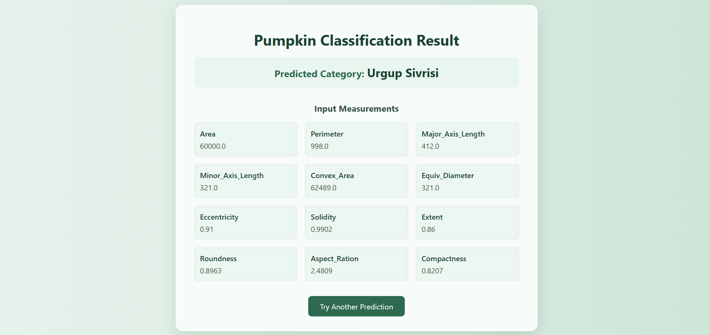

# Harvesting Brilliance: A Taxonomic Tale of Pumpkin Seed Varieties

## Project Overview

**Harvesting Brilliance** is a machine learning–driven web application designed to identify and classify different pumpkin seed varieties based on their morphological characteristics.  
The application accepts multiple numerical attributes such as Area, Perimeter, Major Axis Length, Minor Axis Length, and other shape-related parameters, and then predicts the **type of pumpkin seed variety**.

This system aims to simplify and automate the seed classification process, making it useful for agricultural analysis and research through intelligent prediction techniques.

---

## Features

- Simple and interactive web interface for entering seed parameters
- Trained machine learning model for reliable pumpkin seed classification
- Real-time prediction of seed variety
- Responsive and visually clean user interface

---

## Project Screenshots

### Prediction Page

### Result Page

---

## 👨‍💻 Developed By

Maaj Bairagdar
